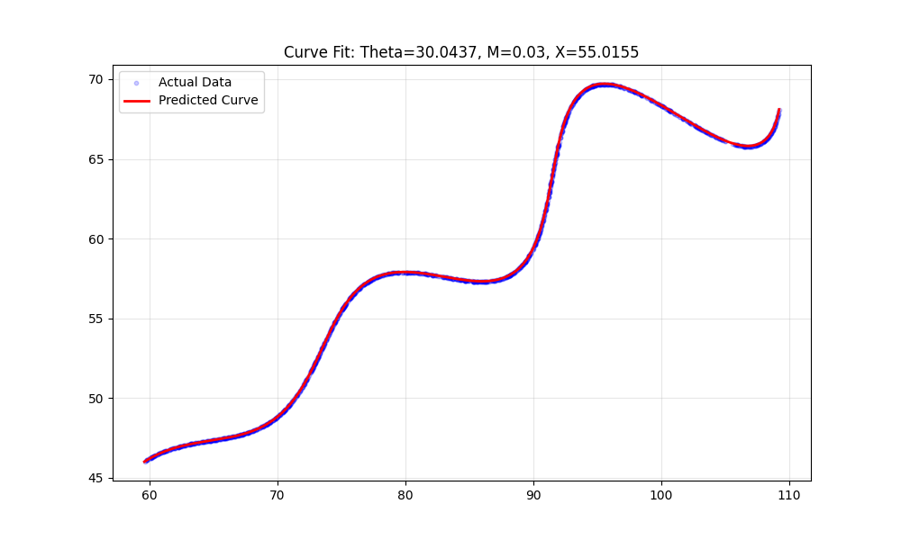

# Curve Parameter Estimation Assignment

## 🎯 Objective
The goal of this assignment was to find the values of three unknown variables—**$\theta$**, **$M$**, and **$X$**—for a specific parametric curve. I was given a dataset (`xy_data.csv`) containing points that lie on this curve.

**The Equations:**
$$
x = t \cdot \cos(\theta) - e^{M \cdot |t|} \cdot \sin(0.3t) \cdot \sin(\theta) + X
$$
$$
y = 42 + t \cdot \sin(\theta) + e^{M \cdot |t|} \cdot \sin(0.3t) \cdot \cos(\theta)
$$

---

## 💡 My Approach

To solve this, I treated it as a numerical optimization problem. Here is the step-by-step process I followed:

### 1. Handling the Data (The "Aha!" Moment)
When I first loaded `xy_data.csv`, I realized the points were not ordered sequentially by time ($t$). Calculating the error directly against a generated time vector gave me huge error values.
* **Solution:** I sorted the dataset by the **x-coordinate**. This allowed me to align the geometric shape of the data with my predicted curve to calculate the error accurately.

### 2. Defining the Error (Cost Function)
I used the **L1 Distance** (Manhattan Distance) to measure how well my parameters fit the data, as required by the assignment:
$$\text{Error} = \sum |x_{actual} - x_{pred}| + \sum |y_{actual} - y_{pred}|$$

### 3. Optimization Strategy
Since the equations involve trigonometric functions (sine/cosine), the error landscape likely has many "local minima" where a standard solver could get stuck.
* **Tool:** I chose **Differential Evolution** (`scipy.optimize.differential_evolution`). This is a global optimization technique that is much better at finding the true best-fit values for complex functions like this.

---

## ✅ Final Results

After running the optimization script, the algorithm converged on these values:

* **$\theta$ (Theta):** `30.0437`
* **$M$:** `0.0300`
* **$X$:** `55.0155`

### Desmos / LaTeX Submission
Here is the equation in the required format for submission:

$$
\left(t \cdot \cos(30.0437) - e^{0.0300 \cdot |t|} \cdot \sin(0.3t) \cdot \sin(30.0437) + 55.0155, \quad 42 + t \cdot \sin(30.0437) + e^{0.0300 \cdot |t|} \cdot \sin(0.3t) \cdot \cos(30.0437)\right)
$$

You can also view the curve here: [Desmos Link](https://www.desmos.com/calculator/rfj91yrxob)

---

## 📊 Visualization
To verify my results, I wrote a script (`visualize.py`) to plot my calculated curve (Red) against the original data points (Blue). As you can see below, the fit is near-perfect.



---

## 💻 How to Run My Code

1.  **Install Dependencies:**
    ```bash
    pip install -r requirements.txt
    ```

2.  **Run the Solver:**
    This script calculates the parameters and prints the results.
    ```bash
    python solver.py
    ```

3.  **Generate the Graph:**
    (Optional) This generates the image shown above.
    ```bash
    python visualize.py
    ```
